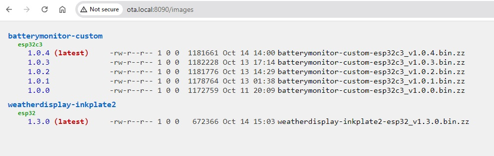
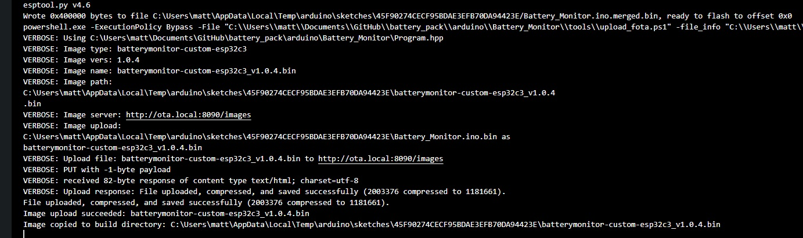

For the server:

```bash
# install nodejs && npm -- needed for ota_server.local which is ota/server/server.js and runs from systemd on port 8090
# install avahi -- needed to pubish ota.local on multicast dns, starts in rc.local AFTER dhcp assignment

# images are stored in /opt/ota/images

$ mkdir -p /opt/ota && cd /opt/ota
$ git clone https://github.com/matthewgream/ota.git
$ cd ota
$ ( cd server && npm install )
$ sudo cp config/*.service /etc/systemd/system
$ if [ -f /etc/rc.local ]; then sudo echo systemctl start avahi-alias@ota.local >> /etc/rc.local; else sudo cp config/rc.local /etc/rc.local; fi
$ sudo systemctl start avahi-alias@ota.local
$ sudo systemctl enable ota_server && sudo systemctl start ota_server

$ ping ota.local
$ journalctl -au avahi-alias@ota.local
$ journalctl -au ota_server
$ curl http://ota.local:8090/images
```

In a browser, http://ota.local:8090/images yields a human readable and sorted list of images.



For the images, can copy them into the `/ota/server/images` directory, noting the specific format and compression, or use a client side tool,
for example see the `client/platform.local.txt` and `client/upload_fota.ps1` which will automate uploads of new version from Arduino IDE.
Images are compressed with zlib in the server before being stored with `.zz` extension.

For the clients, a request with specific type, vers and addr will yield the most recent version of images available (or nothing, if no newer
version). 

```bash
$ curl http://ota.local:8090/images/images.json?type=batterymonitor-custom-esp32c3\&vers=1.0.2\&addr=01:02:03:04:05:06
[{"type":"batterymonitor-custom-esp32c3","version":"1.0.4","url":"http://ota.local:8090/images/batterymonitor-custom-esp32c3_v1.0.4.bin.zz"}]
```

For an Arduino based client, use the `esp32FOTA` library (https://docs.arduino.cc/libraries/esp32fota) and the `esp32-flashz` 
library (https://docs.arduino.cc/libraries/esp32-flashz). You can see an example wrapper in `client/UtilitiesOTA.hpp`. For substantive
documentation, see https://github.com/chrisjoyce911/esp32FOTA.



```C++

#define DEFAULT_NETWORK_SSID "ssid"
#define DEFAULT_NETWORK_PASS "pass"
#define DEFAULT_NETWORK_RETRY_COUNT 20
#define DEFAULT_NETWORK_RETRY_DELAY 1000
#define DEFAULT_SOFTWARE_TIME (60*60*12) // check every 12 hours
#define DEFAULT_SOFTWARE_TYPE "weatherdisplay-inkplate2-esp32"
#define DEFAULT_SOFTWARE_VERS "1.5.1"
#define DEFAULT_SOFTWARE_JSON "http://ota.local:8090/images/images.json"
#include "UtilityOTA.hpp"

uint32_t ota_counter = ... seconds since previous check
DEBUG_PRINTF ("[ota_counter: %lu until %d]\n", ota_counter, DEFAULT_SOFTWARE_TIME);
if (ota_counter >= DEFAULT_SOFTWARE_TIME) {
    ota_counter = 0;
    ota_check_and_update (DEFAULT_NETWORK_SSID, DEFAULT_NETWORK_PASS, DEFAULT_NETWORK_RETRY_COUNT, DEFAULT_NETWORK_RETRY_DELAY,
        DEFAULT_SOFTWARE_JSON, DEFAULT_SOFTWARE_TYPE, DEFAULT_SOFTWARE_VERS, [&] () { program->reset (); });
}
```

Note the server also includes code for address based json configuration requests.
Note also there is no security: no passwords, no certificates, etc and is designed for a local network.

Note the audit trail in the journal:

```syslog
server.js[16428]: express up for 'ota_server' ! -> IPv6/:::8090 [/opt/ota/images]
server.js[16428]: /images manifest request: 1 items, 218 bytes, types=[batterymonitor-custom-esp32c3], type=batterymonitor-custom-esp32c3, vers=1.0.3, addr=24:58:7c:35:e9:e4
server.js[16428]: /images upload succeeded: 'batterymonitor-custom-esp32c3_v1.0.4.bin' (2003376 bytes) --> '/opt/ota/images/batterymonitor-custom-esp32c3_v1.0.4.bin.zz' (1181661 bytes) [::ffff:192.168.0.149]
```


